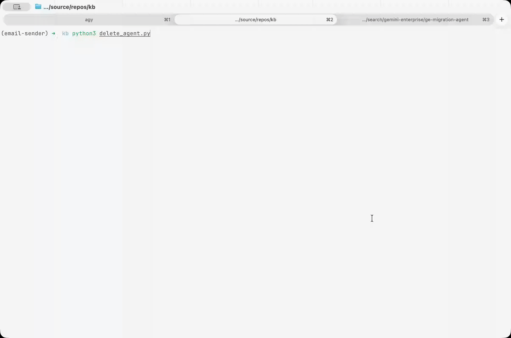

# Gemini Enterprise — Agent Cleanup

A Python CLI tool to delete or unregister agents from Gemini Enterprise apps.


---

## 🚀 How to Run

1. **Prerequisites (gcloud auth)**:
   Ensure you are logged in to the target Google Cloud project:
   ```bash
   gcloud auth login
   gcloud auth application-default login
   gcloud config set project YOUR_PROJECT_ID
   ```

2. **Execute the script**:
   ```bash
   python3 delete_agent.py
   ```

---

## 🛠️ Features

* **Option 1: Browse/Select by Gemini Enterprise App (Standard Flow)**
  Automatically scans Discovery Engine across regions (`global`, `us`, `eu`) to discover your apps, lists all connected agents, and presents them in a clean, interactive picker.
  
* **Option 2: Search by Creator Email (Audit Log Flow)**
  Uses GCP Admin Activity logs to retrieve all agents registered by a specific email (e.g. `user@domain.com`). It checks their active status against live endpoints to filter out deleted "ghost" agents, and lets you choose which remaining ones to delete.

* **Customizable Lookback**: Supports custom lookback durations (e.g., `7d`, `30d`, `90d`, `400d`) to scan historical logs. Since Admin Activity logs are kept for **400 days** by default, you can retrieve registrations up to 400 days old.

* **Safety First**: Validates all inputs, displays full details (type, short ID, target endpoint/engine description), and prompts for explicit confirmation (`y/N`) before running the REST API `DELETE` call.
